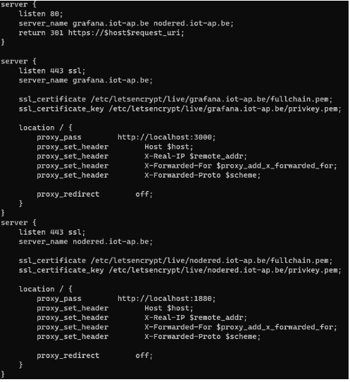

# Reverse-proxy

## Nginx

Voor dit project hebben wij gekozen voor nginx als reverse proxy.

Nginx is gratis en open-source web server software. Het is een high-performance server die meerdere taken kan uitvoeren, zoals HTTP traffic verwerken en proxying. Het is gekend voor zijn stabiliteit, high performance en het gebruik van weinig resources.

Wij hebben hiervoor gekozen opdat dit veel gebruikt wordt in de industrie.

### Config

Hier zien we eenNGINXreverse proxy config. In deze config verwijst de proxy naar Grafana en Nodered. Deze draaien momenteel nog lokaal. Ook SSL certificates zijn voorzien. Deze zijn gemaakt met behulp van certbot.

Om dit werkende te krijgen hebben we eerstalle services geïnstalleerd en vervolgens hebben we ze individueel draaiende gekregen. Vervolgens hebben we dan alles samenlaten draaien via de NGINX ‘default’file. Hierin wordt de config van de NGINX backend opgeslagen.
