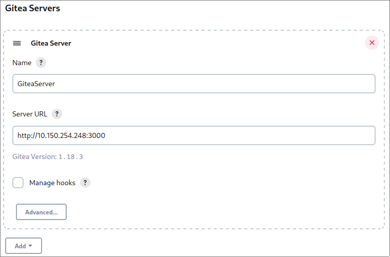
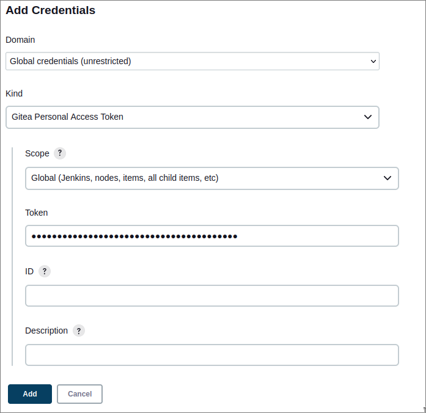

# Gitea & Jenkins

Dit document beschrijft hoe je Gitea en Jenkins kan opzetten om een CI/CD pipeline voor je code te maken, zo kan je bijvoorbeeld na elke commit je code compileren om op errors te checken.

## `docker-compose.yaml`

- VM specs: 4 cores, 4GB memory
- Prerequisites: Docker (zie [Docker documentatie](https://docs.docker.com/engine/install/debian/)), een text editor (e.g. Vim)
- `docker-compose.yaml`:
```yaml
version: "3"
services:
  server:
    image: gitea/gitea:latest
    container_name: gitea
    environment:
      - USER_UID=1000
      - USER_GID=1000
      - GITEA__database__DB_TYPE=postgres
      - GITEA__database__HOST=db:5432
      - GITEA__database__NAME=gitea
      - GITEA__database__USER=gitea
      - GITEA__database__PASSWD=[password]
    restart: unless-stopped
    volumes:
      - ./gitea/data:/data
      - /etc/timezone:/etc/timezone:ro
      - /etc/localtime:/etc/localtime:ro
    ports:
      - "3000:3000"
      - "26:22"
    depends_on:
       - db
  db:
    image: postgres:14
    container_name: postgres
    restart: unless-stopped
    environment:
      - POSTGRES_USER=gitea
      - POSTGRES_PASSWORD=[password]
      - POSTGRES_DB=gitea
    volumes:
      - ./gitea/postgres:/var/lib/postgresql/data
  jenkins:
    image: jenkins/jenkins:lts-jdk11
    container_name: jenkins
    restart: unless-stopped
    privileged: true
    user: root
    ports:
      - 8080:8080
      - 50000:50000
    container_name: jenkins
    volumes:
      - ./jenkins_compose/jenkins_configuration:/var/jenkins_home
      - /var/run/docker.sock:/var/run/docker.sock
```

- `docker compose up -d`

## Gitea

- Ga naar `http://[IP]:[port]`
- Volg instructies op scherm en maak (optioneel) een admin user aan
- Signups uitzetten:
	- `sudo vim data/gitea/conf/app.ini`
	- `DISABLE_REGISTRATION = true`

## Jenkins

### Integratie met Gitea

- Maak een user genaamd `Jenkins` aan
	- Log in als deze user en genereer een access token (onder `settings` > `applications`)
	- Je krijgt deze token maar 1x te zien, noteer ze dus ergens!
- Maak een organizatie aan, e.g. `Zanzibar`
- Maak een repo aan in deze organizatie, e.g. `JenkinsTest`
- Klik linksboven op `settings` en voeg onder de tab collaborators de Jenkins user toe (zorg dat deze write-toestemming heeft)

### Jenkins

- Unlock Jenkins met het gegenereerde wachtwoord (zie `docker logs [container name]`, waar `[container name]` de naam is van de Jenkins container)
- Recommended plugins installeren is aanbevolen
- Installeer de `Gitea Plugin` plugin ([docs](https://plugins.jenkins.io/gitea))
- Ga naar de dashboard en klik op `Manage Jenkins`, daarna `Configure System`
	- Scroll naar beneden tot je `Gitea Servers` ziet staan
	- Voeg hier je server toe door ze een naam te geven en het IP adres (of de domeinnaam) in te vullen



- Voeg een nieuw item toe aan Jenkins, kies voor `Organization Folder`
- Onder `Projects` voeg je een Gitea Organization toe als Repository Source
	- Selecteer als `Server` de server die je eerder hebt toegevoegd
	- Voeg nieuwe credentials toe door op `+ Add` te klikken en dan op `Jenkins`
		- Als token gebruik je de eerder aangemaakte API token
		- Optioneel kan je deze een naam en/of beschrijving geven
	- Bij `Owner` geef je naam van je organisatie in



- Na deze stappen kan je in de root van je repo een `Jenkinsfile` toevoegen en in Jenkins op `Scan Gitea Organization Now` klikken
- Als alles correct is, zou er onder `Scan Gitea Organization Log`  repo gevonden moeten zijn (die met de `Jenkinsfile`)
