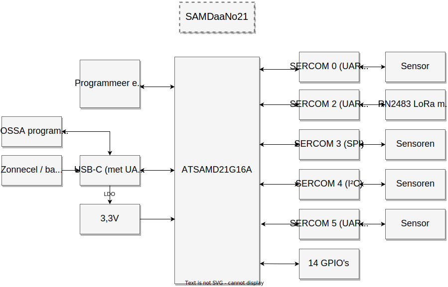

 # Flexible LoRaWAN Sensor Board SAMDaaNo21

Het FLWSB Main Board is een microcontroller bord gebaseerd op de ATSAM D21 in de vormfactor vergelijkbaar met een Arduino Nano. Het mot gemakkelijk zijn om dit bord in een breadboard te prikken en zo testen uit te voeren of schakelingen te bouwen. Het elektrisch schema van dit bord ziet er als volgt uit:

<figure>

<figcaption >Figuur 1: FLWSB-SAMDaaNo21 schema</figcaption>
</figure>
Alle onderdelen worden verder toegelicht.

[ATSAM D21 Datasheet](https://ww1.microchip.com/downloads/en/DeviceDoc/SAM-D21DA1-Family-Data-Sheet-DS40001882G.pdf)

## USB Interface & VIN

<figure>

<figcaption >Figuur 2: USB Interface & VIN schema</figcaption>
</figure>
Het schema voor de USB-interface is gebaseerd op een voorbeeld uit een Atmel handleiding. De zener diodes die zichtbaar zijn zorgen ervoor dat de kans op schade door elektrostatische ontlading (ESD) beperkt wordt. 

<figure>

<figcaption >Figuur 2: USB Interface & VIN schema</figcaption>
</figure>

[Ref1](https://ww1.microchip.com/downloads/en/DeviceDoc/Atmel-42261-SAM-D21-USB_Application-Note_AT06475.pdf)

[Ref schematic checklist](https://ww1.microchip.com/downloads/en/DeviceDoc/SAM-D21DA1-Family-Data-Sheet-DS40001882G.pdf#_OPENTOPIC_TOC_PROCESSING_d10240e380866)

De Schottky diode (D6) is er om de USB poort van je laptop te beschermen wanneer het bord van stroom wordt voorzien via de VIN pin. Het zou kunnen dat aan de VIN pin een hogere spanning wordt geleverd dan 5V waardoor dit potentiaalverschil ongewenste stroom kan laten vloeien. Hetzelfde principe wordt toegepast bij de ESP32 DEVKIT.

[Ref1](https://dl.espressif.com/dl/schematics/esp32_devkitc_v4-sch-20180607a.pdf)

## RESET & DEBUG

<figure>

<figcaption >Figuur 3: RESET & DEBUG schema</figcaption>
</figure>
De reset knop is opgebouwd zoals in de datasheet van de ATSAM D21 wordt weergegeven onder de Schematic Checklist Figure 45-4. External Reset Circuit Schematic.

## Low Dropout Lineair Regulator

<figure>

<figcaption >Figuur 4: Low Dropout Lineair Regulator schema</figcaption>
</figure>
In dit geval wordt er een LD1117 3,3 V regelaar gebruikt. Deze regelaar kan met een vrij groot ingangsbereik (tot 15 V) een uitgangsspanning van 3,3 V leveren. 

[LD1117 datasheet](https://www.st.com/resource/en/datasheet/ld1117.pdf)

## Power Supply Connections

<figure>

<figcaption >Figuur 5: Power Supply Connections schema</figcaption>
</figure>
Het schema voor de ontkoppelcondensatoren en spoel voor de ATSAM D21 komt ook rechtstreeks uit de datasheet. Wat belangrijk is bij deze componenten is dat alles rechts van de blauwe snippenlijn zo dicht mogelijk bij de vermelde pinnen staat. Deze condensatoren vangen kleine storingen en rimpels op die zich voordoen in de bronspanning.

## Input / Output

<figure>

<figcaption >Figuur 5:  Input / Output schema</figcaption>
</figure>
Dit zijn alle GPIO, SERCOM en power aansluitingen die via pinheaders naar buiten worden gebracht. De SERCOM poorten zijn alvast gedefinieerd zodat onder andere de pull-up weerstanden geplaatst kunnen worden. Alle andere poorten zijn voor algemeen gebruik. In de datasheet van de ATSAM D21 onder 7. I/O Multiplexing and Considerations kunnen alle verschillende mogelijkheden van deze aansluitingen gevonden worden (AC, ADC, DAC, PTC, DAC, IO, ...). 

| Pin  | Functies                                                     |
| ---- | ------------------------------------------------------------ |
| PB02 | EXTINT[2], AIN[10], Y[8], TC6/WO[0], TCC3/WO[2]              |
| PB03 | EXTINT[3], AIN[11], Y[9], TC6/WO[1], TCC3/WO[3]              |
| PA02 | EXTINT[0], TCC2/WO[0]                                        |
| PA03 | EXTINT[1], TCC2/WO[1]                                        |
| PA06 | EXTINT[6], AIN[6], AIN[2] AC, Y[4], TCC1/WO[0], TCC3/WO[4]   |
| PA09 | EXTINT[9], AIN[17], X[1], TCC0/WO[1], TCC1/WO[3], I2S/MCK[0] |
| PA10 | EXTINT[10], AIN[18], X[2], TCC1/WO[0], TCC0/WO[2], I2S/SCK[0], GCLK_IO[4] |
| PA11 | EXTINT[11], AIN[19], X[3], TCC1/WO[1], TCC0/WO[3], I2S/FS[0], GCLK_IO[5] |
| PA14 | EXTINT[14], X[14], TC5/WO[0], GCLK_IO[0]                     |
| PA15 | EXTINT[15], X[15], TC5/WO[1], GCLK_IO[1]                     |
| PA19 | EXTINT[3], X[7], TC3/WO[1], TCC0/WO[3], I2S/SD[0], AC/CMP[1] |
| PA20 | EXTINT[4], X[8], TC7/WO[0], TCC0/WO[6], I2S/SCK[0], GCLK_IO[4] |

| Pin                     | Functies                                                     |
| ----------------------- | ------------------------------------------------------------ |
| SERCOM0_PAD0_TX (PA04)  | EXTINT[4], ADC/VREFB, AIN[4], AIN[0] AC, Y[2], TCC0/WO[0],TCC3/WO[2] |
| SERCOM0_PAD1_RX (PA05)  | EXTINT[5], AIN[5], Y[3], TCC0/WO[1], TCC3/WO[3]              |
| SERCOM2_PAD1_TX (PA08)  | NMI, AIN[16], X[0], TCC0/WO[0], TCC1/WO[2], I2S/SD[1]        |
| SERCOM2_PAD2_RX (PA09)  | EXTINT[9], AIN[17], X[1], TCC0/WO[1], TCC1/WO[3], I2S/MCK[0] |
| SERCOM5_PAD0_TX (PA22)  | EXTINT[6], X[10], TC4/WO[0], TCC0/WO[4], GCLK_IO[6]          |
| SERCOM5_PAD1_RX (PA23)  | EXTINT[7], X[11], TC4/WO[1], TCC0/WO[5], USB/SOF 1kHz, GCLK_IO[7] |
| SERCOM4_PAD0_SDA (PA12) | EXTINT[12], TCC2/WO[0], TCC0/WO[6], AC/CMP[0]                |
| SERCOM4_PAD1_SCL (PA13) | EXTINT[13], TCC2/WO[1], TCC0/WO[7], AC/CMP[1]                |
| SERCOM3_MISO (PA18)     | EXTINT[2], X[6], TC3/WO[0], TCC0/WO[2], AC/CMP[0]            |
| SERCOM3_MOSI (PA16)     | EXTINT[0], X[4], TCC2/WO[0], TCC0/WO[6], GCLK_IO[2]          |
| SERCOM3_SCK (PA17)      | EXTINT[1], X[5], TCC2/WO[1], TCC0/WO[7], GCLK_IO[3]          |
| PB09                    | EXTINT[9], AIN[3], Y[15], TC4/WO[1], TCC3/WO[7]              |
| PB08                    | EXTINT[8], AIN[2], Y[14], TC4/WO[0], TCC3/WO[6]              |
| PA21                    | X[9], TC7/WO[1], TCC0/WO[7], I2S/FS[0], GCLK_IO[5]           |

### Legende

`SERCOM`: Serial Communication, keuze tussen: USART, I²C, SPI of SMBus

`EXTINT[n]`: External Interrupts

`AIN[n]`: ADC Analog Inputs

`X[n]`, `Y[n]`: Peripheral Touch Controller - PTC Input

`TC4/WO[n]`, `TC6/WO[n]`: Waveform/PWM Outputs

`TCC3/WO[n]`: Waveform/PWM Outputs/ Capture Inputs 

`AC/CMP[n]`: AC Comparator Outputs

`I2S/FS[n]`: Inter-IC Sound Controller, I²S Word Select or TDM Frame Sync

`GCLK_IO[n]`: Generic Clock (source clock or generic clock generator output)

